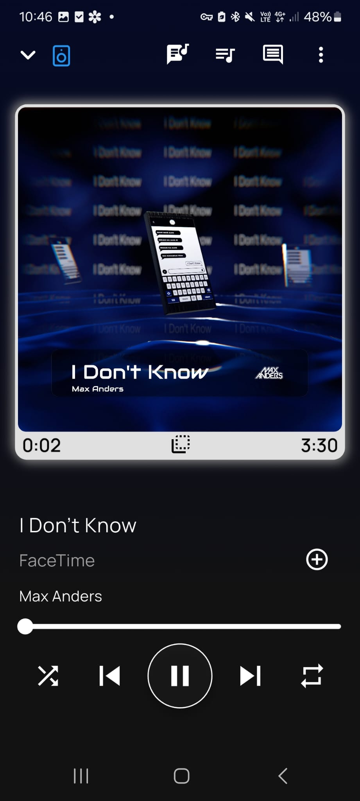
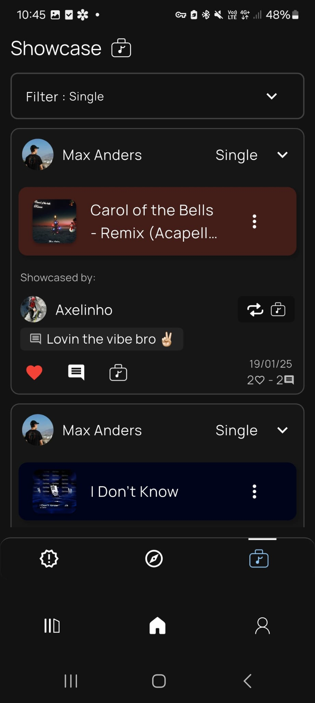
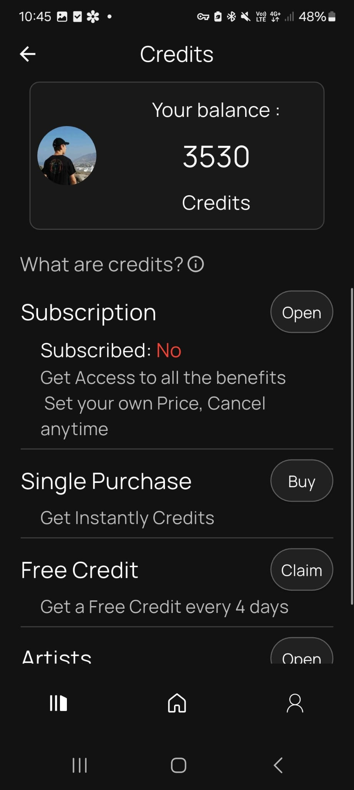
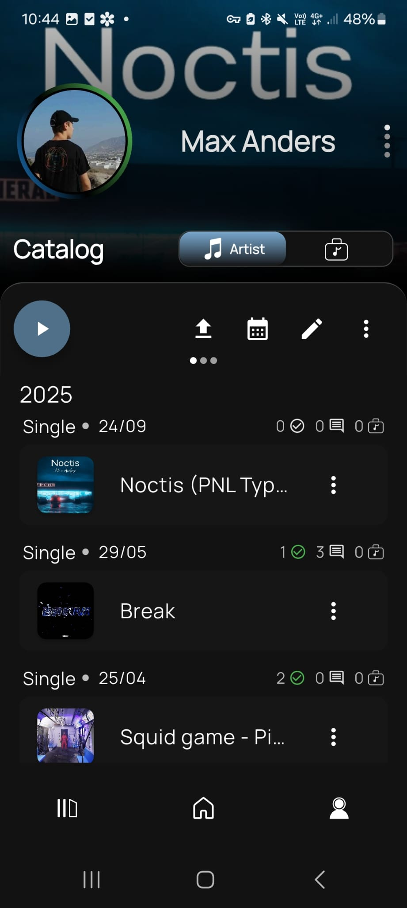

  

# Showcaze 🎵📱

**Showcaze** is a social music streaming platform that empowers artists and fans through sharing, showcasing, and discovery. 
Built with Flutter, it combines the best of streaming and social networks into a single mobile experience.  

---

## 🚀 Key Features  
**🎵 Three Feeds**  
- *Showcase*: music shared by friends & curators  
- *New Releases*: latest tracks from followed artists  
- *Discovery*: live feed of all new uploads  

**⭐ Showcasing System**  
- Share songs like “retweets”  
- Build personal portfolios & playlists  
- Artist pages with full catalogs  

**💬 Engagement**  
- Real-time comments (*live mode*)  
- Highlighted popular discussions  
- Share teasers & works-in-progress  

**💰 Monetization**  
- Showcase songs using credits  
- Stripe/RevenueCat subscriptions  
- Artists withdraw credits as revenue

---

## 📱 Deployment & Platforms

Showcaze is built with **Flutter**, making it fully cross-platform.  
- ✅ Web version is publicly available (early access)  
- 📱 iOS and Android builds are ready, awaiting more testers before public release  

---

## 🛠️ Tech Stack
- **Frontend:** Flutter (Dart)  
- **Auth:** Firebase & Supabase
- **Backend:** Firebase, Google Cloud Functions (Typescript)
- **Payments:** Stripe + RevenueCat  
- **Other:** Firebase Tools (Firestore, Hosting,..), REST APIs, Supabase, Getstream
- **Media:** Just Audio (high-quality playback)  

---

## 📸 Screenshots

| Player | Feed | Credits | Profile |
|-------|------|--------|---------|
|  |  |  |  |

---

## 🌐 Links
- 🔗 [Website / Landing Page](https://info.showcaze.app)  
- 📱 Beta testing in progress — [sign up](https://showcaze.app)  

---

## 📌 About the Project
I started developing **Showcaze** as a personal project at the intersection of music and technology.  
It’s a social music streaming platform where independent artists can share tracks, and users can “showcase” them (similar to a retweet), which boosts visibility and supports artists financially.  

The project explores new ways to combine streaming, community, and fairer economic models for musicians, while leveraging Flutter, Firebase, and Stripe to build a scalable mobile platform.

## 📌 Status
- Beta version in development  
- Active feature expansion and early user testing  
- Seeking collaborators and feedback to scale the platform 

---

